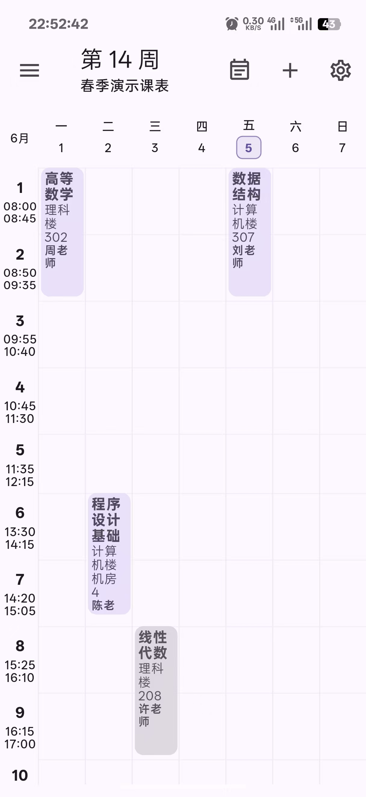
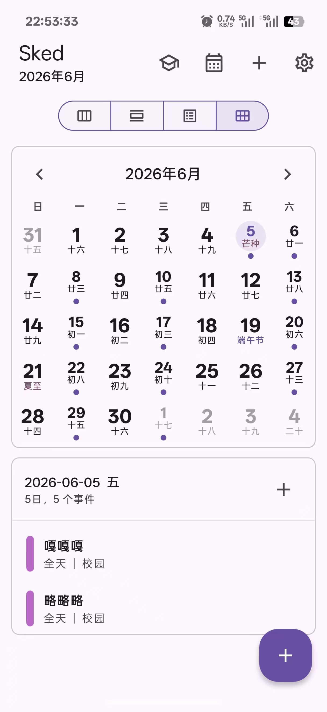
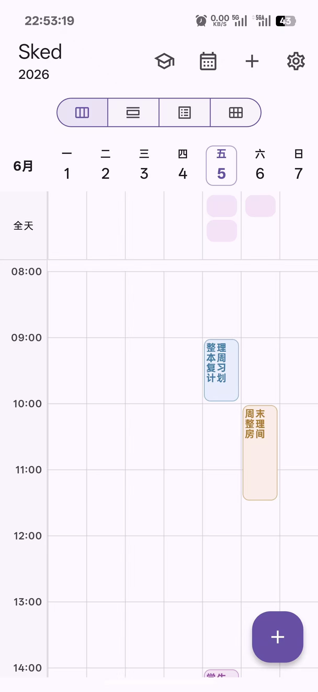
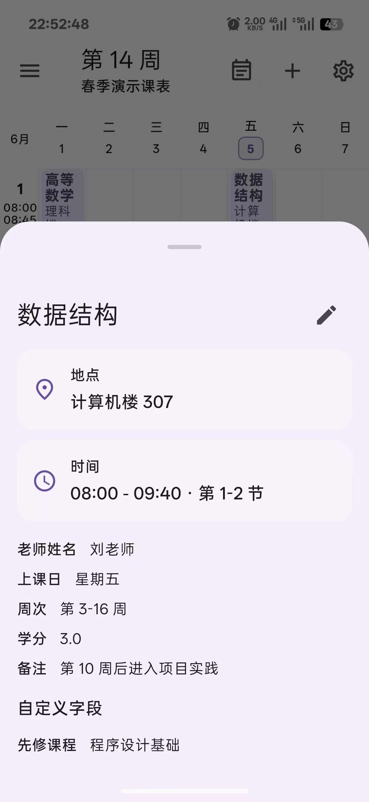
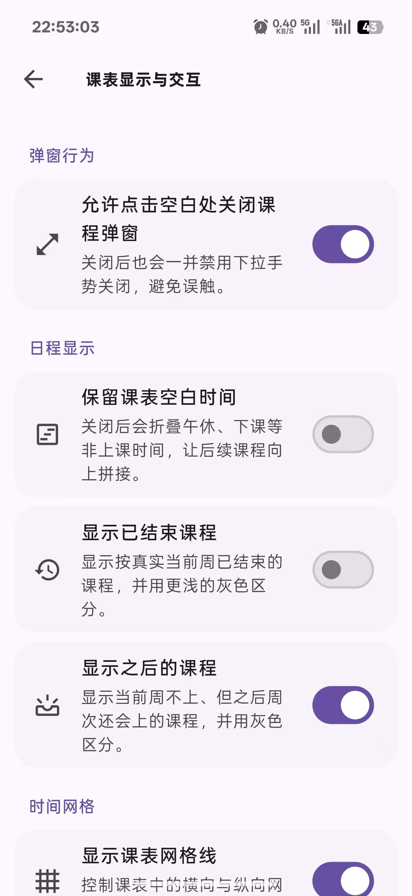
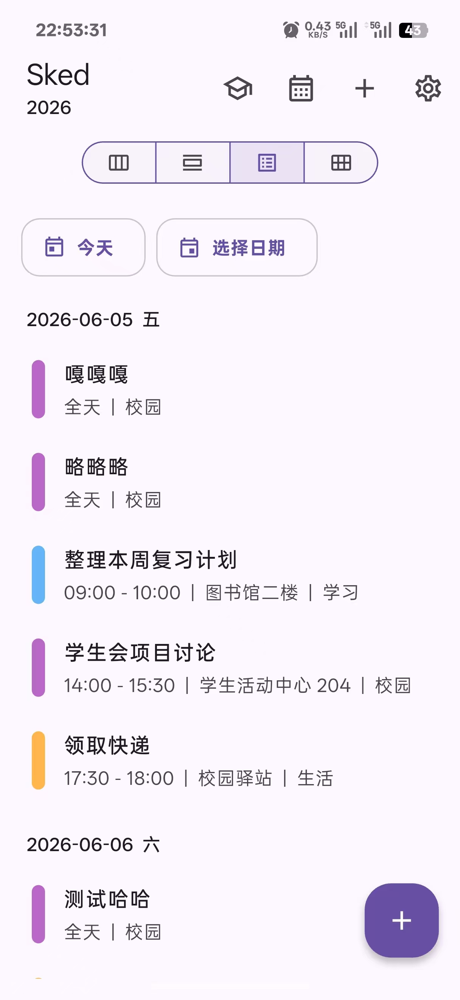
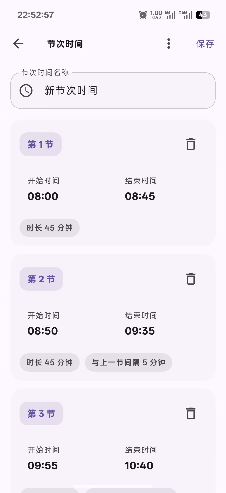

# LinkStudy
> **ÑÜÉúÏîÄ¿**£ºLinkStudy ÊÇ»ùÓÚ [Sked](https://github.com/Mashiro0619/Sked) µÄ¶ş´Î¿ª·¢£¨AGPL-3.0£©£¬±£ÁôÁË Sked µÄ UI Ó벿·Ö¹¦ÄÜ£¬²¢ÓÉ TheoHowie ĞÂÔöÍø¿ÎÁ´½Ó²É¼¯¡¢Ğü¸¡´°ÓëÅÅ¿ÎÄÜÁ¦¡£

### 课表�日程管�工�
<a href="README_EN.md">English</a>
&nbsp;&nbsp;|&nbsp;&nbsp;
简体中�

  
   
  

Sked 是一个��学生课表和日常安�的管�工具。你�以用它整�课程�周次�节次时间和学校站点，也�以切�到通用日程模�记录事件��醒和��安�。应用支�课表导入导出�完整备份��，以�通过自定义解���辅助导入学校网页或文本 / HTML 课表内容�
## 截图

## 主�功能

- **学生课表**：创建�切��编辑和删除多个课表，按周查看课程安�，并显示当�课程�下一节课程和学期进度�- **课程编辑**：维护课程�称�地点�教师�周次�节次�关�时间�备注和自定义字段�- **节次时间�*：�用�编辑�导入和导出节次模�，并在多个课表之间共享�- **通用日程**：使用独立日程模�管�事件�日���醒���规则�月视图�日视图�周视图和列表视图�- **导入导出**：支�课�JSON 文件�课�JSON 文本导入 / 导出�通用日程 JSON / ICS�学校站�JSON�节次模��分享和完整应用备份 / ���- **文本 / HTML 解�导入**：在应用内打开学校站点，或粘贴普通课表文本�页�文本�HTML ��，并通过你自己�置的 OpenAI 兼容��解�课表�- **导入预览**：�存�查看解�结�，选择节次时间集，并决定导入为新课表或替�当�课表�- **主题�界�*：支�浅色�深色�跟�系统�主题色和多彩界��置，并�续�移到 Material 3 Expressive �格�- **数��制**：课表�日程和设置默认�存在当�设备；完整备份�包�自定义解� API 密钥�
## 数����
Sked 会在设备或�览器本地�存学生课表�通用日程�应用设置�节次时间集和学校站点�置。完整应用备份会导出这些数�，但�会包�自定义解�API 密钥�
�有在你主动执行导入�导出�分享�打开外部链��检查更新���模�列表�学校网页导入或解�课表文本 / HTML 内容时，应用�会访问相关文件�调用系统功能或��你�置的外部���
首次�动应用时会显示��政策确认。完整��政策��[https://sked.mashiro.tech/privacy.html](https://sked.mashiro.tech/privacy.html) 查看�
## 自定义解���
Sked �内置课表解���。学校网页导入和文本 / HTML 解�导入�会使用你在应用内“课表解�设置�填写的 OpenAI 兼容���
解��置包括�
- `Base URL`：OpenAI 兼容��地�，例�`https://api.example.com/v1` 或�信内�`http://192.168.1.10:8000/v1`
- `API 密钥`：��到该��的 Bearer Token，应用会尽�能通过平�安全存储�存
- `模��称`：�天补全模��称，�手动填写，也��自定义����模�列表
- `自定义�示�`：�选；留空时使用应用内置课表解��示�

请求行为�
- ��模�列表会请求你填写�`Base URL` 下的 `/models`
- 解�课表会请求你填写�`Base URL` 下的 `/chat/completions`
- 请求会�带你主动�交的普通课表文本�页�文本或 HTML 内容��选页�标题�页�URL�当�应用语言和解��示�
- 如�使用 `http://` Base URL，请�在�信设备��信网络和�信���务中使用，因为内容�API 密钥�能��传输层加密��
## 贡献

欢��交 Issue �Pull Request。也欢��`assets/school_sites.json` 补充学校站点�置。�交�请尽����有��边界�数�兼容性和导入导出行为�
## 开��议�第三方说�
- ��基� [GNU Affero General Public License v3.0](LICENSE) 开��- 项目内分�的�动图标�相关平�图标资�包�第三方��内容，详�[NOTICE](NOTICE)�- Flutter �赖�第三方库许��在应用内“设�-> 开�许��查看�